# 🎬 Entros - Movie & TV Show Discovery Platform

<div align="center">


**Discover your next favorite film or show**

[](https://entros.vercel.app)
[](LICENSE)
[](https://reactjs.org/)
[](https://vitejs.dev/)

</div>

---

## 🌟 Overview

**Entros** is a modern, responsive web application that helps users discover movies, TV shows, and entertainment content. Built with React and powered by The Movie Database (TMDb) API, it provides a sleek interface for exploring trending content, searching across multiple media types, and accessing detailed information about movies, shows, actors, and collections.

### ✨ Key Features

- 🔍 **Advanced Search** - Search movies, TV shows, and people with advanced filtering
- 🎭 **Detailed Information** - Comprehensive details for movies, TV shows, actors, and collections
- 🏷️ **Genre Filtering** - Browse content by your favorite genres
- 📈 **Trending Content** - Stay updated with what's popular and trending
- ⭐ **Top Rated** - Discover critically acclaimed movies and TV shows
- 🎪 **Cast & Crew** - Explore detailed actor and director profiles
- 📺 **Season Details** - Episode-by-episode information for TV shows
- 🎬 **Watch Providers** - Find where to stream your favorite content
- 📱 **Responsive Design** - Perfect experience across all devices
- 🎨 **Modern UI** - Clean, intuitive interface with smooth animations

---

## 🏗️ Architecture Overview

```mermaid
graph TB
    subgraph "Frontend (React + Vite)"
        A[User Interface] --> B[React Components]
        B --> C[React Router]
        C --> D[Pages]
        D --> E[Components]
    end
    
    subgraph "API Layer"
        F[TMDb API Client] --> G[Axios HTTP Client]
        G --> H[TMDb REST API]
    end
    
    subgraph "External Services"
        I[TMDb Database] --> H
        J[Vercel Analytics] --> A
        K[Vercel Hosting] --> A
    end
    
    A --> F
    E --> F
```



---

## 📊 Data Flow Architecture


---

## 🧩 Component Architecture


---

## 🔄 Application State Flow


---

## 🚀 What Problems Does Entros Solve?

### 🎯 Content Discovery Challenge
- **Problem**: With thousands of movies and shows across multiple platforms, finding quality content is overwhelming
- **Solution**: Entros provides intelligent content discovery with trending algorithms, genre filtering, and advanced search capabilities

### 📊 Information Fragmentation
- **Problem**: Entertainment information is scattered across different websites and platforms
- **Solution**: Centralized hub with comprehensive details, ratings, cast information, and streaming availability

### 📺 Unsure Where to Watch?
- **Problem**: Not sure which platform streams your favorite movie or show?
- **Solution**: Entros shows you exactly where to watch—no more guessing or endless searching.

### 📱 Poor Mobile Experience
- **Problem**: Many entertainment sites have poor mobile interfaces
- **Solution**: Mobile-first responsive design with touch-friendly interactions

---

## 🛠️ Tech Stack

| Technology | Purpose | Version |
|------------|---------|---------|
| **React** | Frontend Framework | 18.3.1 |
| **Vite** | Build Tool & Dev Server | 6.0.5 |
| **Tailwind CSS** | Styling & UI | 3.4.17 |
| **React Router** | Client-side Routing | 7.1.1 |
| **Axios** | HTTP Client | 1.7.9 |
| **TMDb API** | Movie/TV Data Source | v3 |
| **Vercel Analytics** | Usage Analytics | 1.4.1 |
| **ESLint** | Code Quality | 9.17.0 |

---

## 📁 Project Structure

```
entros/
├── public/                 # Static assets
├── src/
│   ├── api/
│   │   └── tmdb.js        # TMDb API integration
│   ├── components/         # Reusable UI components
│   │   ├── Backdrop.jsx
│   │   ├── MovieCard.jsx
│   │   ├── SearchBar.jsx
│   │   ├── GenreFilter.jsx
│   │   └── ... (15 components)
│   ├── pages/             # Route components
│   │   ├── HomePage.jsx
│   │   ├── MovieDetailsPage.jsx
│   │   ├── TvDetailsPage.jsx
│   │   ├── PersonDetailsPage.jsx
│   │   └── CollectionDetailsPage.jsx
│   ├── utils/             # Utility functions
│   │   └── imageUtils.js
│   ├── App.jsx            # Main app component
│   ├── main.jsx           # App entry point
│   └── index.css          # Global styles
├── package.json           # Dependencies & scripts
├── vite.config.js         # Vite configuration
├── tailwind.config.js     # Tailwind CSS config
└── README.md              # Project documentation
```

---

## 🚀 Quick Start

### Prerequisites
- **Node.js** (v16 or higher)
- **npm** or **yarn**
- **TMDb API Key** ([Get one here](https://www.themoviedb.org/settings/api))

### Installation

1. **Clone the repository**
   ```bash
   git clone https://github.com/rajofearth/entros.git
   cd entros
   ```

2. **Install dependencies**
   ```bash
   npm install
   ```

3. **Environment Setup**
   Create a `.env` file in the root directory:
   ```env
   VITE_TMDB_API_KEY=your_tmdb_api_key_here
   ```

4. **Start development server**
   ```bash
   npm run dev
   ```

5. **Open your browser**
   Navigate to `http://localhost:5173`

### Production Build

```bash
# Build for production
npm run build

# Preview production build locally
npm run preview
```

---

## 🎯 Core Features Deep Dive

### 🔍 Search Functionality
- **Multi-type Search**: Movies, TV shows, and people in one search
- **Advanced Filters**: Year range, rating range, genre selection
- **Smart Scoring**: Algorithm prioritizes relevant, recent, and high-quality content
- **Real-time Results**: Instant search with endless database of movies/tvshows

### 📱 Responsive Design
- **Mobile-First**: Optimized for small screens with touch interactions
- **Tablet Support**: Perfect layout for medium-sized devices
- **Desktop Experience**: Full-featured interface for large screens
- **Cross-Browser**: Compatible with all modern browsers

### 🎨 User Experience
- **Loading States**: Smooth loading spinners and skeletons
- **Error Handling**: Graceful error messages and fallbacks
- **Animations**: Subtle hover effects and transitions
- **Accessibility**: Keyboard navigation and screen reader support

---

## 🌐 API Integration

Entros integrates with **The Movie Database (TMDb) API** to provide:

- Movie and TV show search
- Detailed content information
- Cast and crew data
- Genre listings
- Trending content
- Top-rated content
- Watch provider information
- Collection details
- Person filmographies

### API Endpoints Used

```mermaid
graph LR
    A[TMDb API] --> B[search/movie]
    A --> C[search/tv]
    A --> D[search/person]
    A --> E[movie/{id}]
    A --> F[tv/{id}]
    A --> G[person/{id}]
    A --> H[trending/movie/week]
    A --> I[trending/tv/week]
    A --> J[movie/top_rated]
    A --> K[tv/top_rated]
    A --> L[discover/movie]
    A --> M[discover/tv]
```

---

## 🧠 Smart Content Scoring Algorithm

The application uses a sophisticated scoring algorithm to rank content:


**Scoring Factors:**
- **Recency Weight**: 40% - Newer content gets higher scores
- **Vote Average Weight**: 30% - Higher-rated content preferred
- **Hollywood Boost**: 60% bonus for US-produced content
- **Movie Boost**: 90% bonus for movies over TV shows
- **Time Decay**: Exponential decay over 365 days

---

## 📊 Performance & Analytics

- **Vercel Analytics**: Track user engagement and popular content
- **Optimized Images**: Lazy loading and responsive images from TMDb
- **Code Splitting**: Route-based code splitting for faster load times
- **Caching**: Smart caching of API responses

---

## 🚀 Deployment

### Vercel (Recommended)
```bash
# Install Vercel CLI
npm i -g vercel

# Deploy
vercel
```

### Other Platforms
The app can be deployed to any static hosting service:
- **Netlify**
- **GitHub Pages**
- **Firebase Hosting**
- **AWS S3 + CloudFront**

---

## 📄 License

This project is licensed under the **MIT License** - see the [LICENSE](LICENSE) file for details.

---

## 🤝 Contributing

We welcome contributions! Please see our [Contributing Guide](CONTRIBUTORS.md) for details on how to get started.

---

## 🙏 Acknowledgments

- **The Movie Database (TMDb)** for providing the comprehensive movie and TV data API
- **React Team** for the amazing framework
- **Vercel** for hosting and analytics
- **Tailwind CSS** for the utility-first CSS framework

---

<div align="center">

**Made with ❤️ for movie and TV show enthusiasts**

[⭐ Star this repo](https://github.com/rajofearth/entros) | [🐛 Report Bug](https://github.com/rajofearth/entros/issues) | [💡 Request Feature](https://github.com/rajofearth/entros/issues)

</div>
